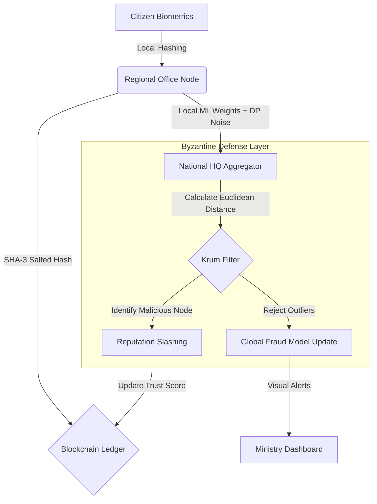
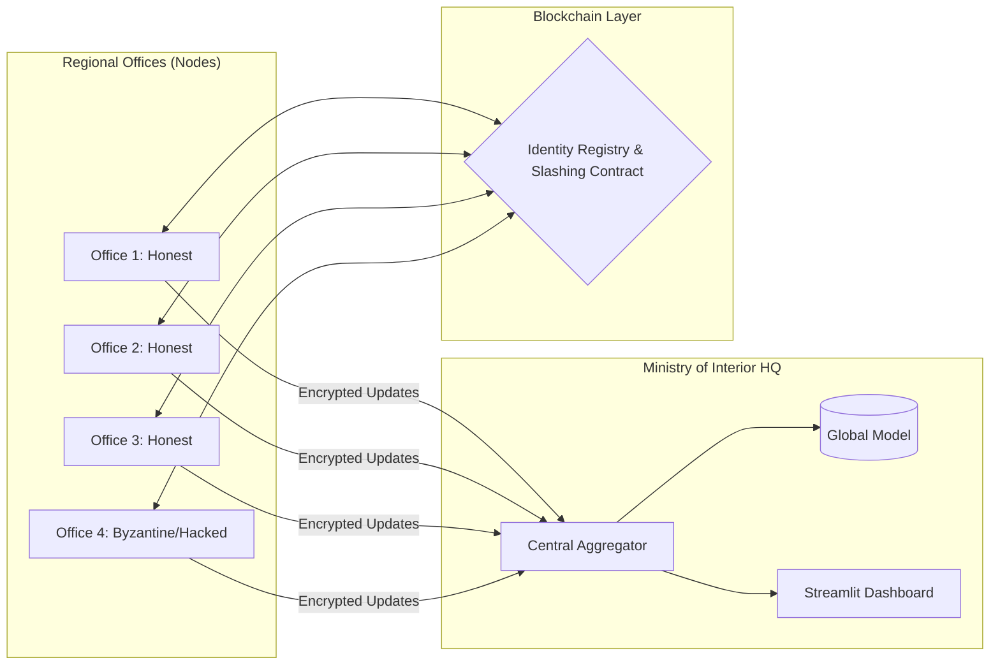

# Topic: A Byzantine-Robust Federated Framework for Secure Civil Registry and Identity Fraud Detection

A Blockchain-Integrated Framework with Byzantine-Robust Aggregation and Differential Privacy

## 📖 Overview

The Ministry of Interior Identity Framework (MoI-IDF) is a decentralized, privacy-preserving system designed for national civil registries. It solves the critical conflict between Big Data AI (Fraud Detection) and Citizen Privacy.

By combining Federated Learning, Blockchain, and Byzantine-Robust Algorithms, this framework can detect identity fraud even when regional offices (nodes) are compromised by state-sponsored cyber-attacks or internal corruption.

## 🚀 Key Features

- 🔒 Identity Commitment (SHA-3): Anonymizes biometric data using salted hashing before it ever leaves the regional office.

- 🛡️ Byzantine-Robust Aggregation (Krum): A mathematical defense layer that identifies and rejects "Data Poisoning" attempts from compromised nodes.

- 👁️ Differential Privacy (Laplace): Mathematically guarantees that individual citizen records cannot be reconstructed from global model updates.

- ⛓️ Blockchain Reputation: A smart-contract-driven system that "slashes" the reputation of malicious offices and isolates them from the national network.

- 📊 Real-Time Command Center: A custom Streamlit dashboard for Ministry officials to monitor network health and outlier detection.

## 🏗️ The Problem: Vulnerabilities in National Registries

Traditional centralized identity systems suffer from three primary failure points:

- Single Point of Failure: A compromise at the central database leaks the entire nation's biometric data.

- Insider Corruption: Regional clerks can be bribed to inject "Ghost Identities" or manipulate records.

- Poisoning Attacks: Malicious actors can compromise regional servers to feed false fraud-detection data, effectively blinding the Ministry's ability to detect identity theft.

MoI-IDF introduces a "Trustless" architecture where no single entity—not even a regional office—can compromise the integrity of the national database.

## 🧩 System Architecture & Pillars

1. Identity Commitment Layer (Zero-Knowledge Approach)

Instead of transmitting raw biometric data (fingerprints/iris scans), each node performs a local Salted SHA-3 Hashing operation.

- Security Benefit: Even if a hacker gains "Read Access" to the blockchain, they cannot reverse the hashes to reconstruct the citizen's biometrics.

- Formula : $$H = \_{SHA3-256}(\_{Biometrics} \parallel \_{Regional\_Secret})$$

2. Privacy-Preserving Federated Learning

The Ministry trains its fraud-detection models locally at each regional office. Only the model weights (mathematical patterns) are sent to HQ, never the citizen's records.

- Differential Privacy: To prevent "Membership Inference Attacks" (where an attacker guesses if a person is in the database), we inject noise into the weights.

- Mechanism: $W_{noised} = W_{local} + \text{Laplace}(0, \frac{\Delta f}{\epsilon})$.

3. Byzantine-Robust Security (Krum Aggregator)

This is the framework's "Liar Detector." Most systems use "Averaging" to combine data. An attacker can send a value of 1,000,000 to ruin an average. Krum ignores the average and finds the "Consensus Cluster."

- Logic: It calculates the $L2$-distance between all updates and selects the update that has the smallest distance to its neighbors, effectively "muting" the attacker.

4. Blockchain Ledger & Reputation

The system maintains a Proof-of-Authority (PoA) blockchain.

- Slashing: If the Krum Aggregator flags a node as an outlier, a Smart Contract automatically deducts "Reputation Points."

- Auto-Quarantine: If reputation falls below $50\%$, the node's cryptographic keys are revoked, and it is kicked off the network.

### 🔄 Logical Data Flow



### 🗺️ System Topology



## 🛠️ Technical Implementation

The Math Behind the Defense

The framework utilizes the Krum Aggregator to select the most "central" update $V_i$ by minimizing the sum of squared Euclidean distances to its $n-f-2$ nearest neighbors:

$$S(V_i) = \sum_{j \in \mathcal{N}_i} \| V_i - V_j \|^2$$

Privacy Guarantee

We apply the Laplace Mechanism to satisfy $\epsilon$-Differential Privacy:

$$M_{priv} = M_{raw} + \text{Laplace} \left( 0, \frac{\Delta f}{\epsilon} \right)$$

## 🖥️ Dashboard Preview

Live Demo: [Byzantine-Robust-Identity-Framework](https://byzantine-robust-identity-framework.streamlit.app/)

The dashboard provides:

- System Trust Score: Average reputation of all regional offices.

- Krum Outlier Map: Visual proof of the mathematical rejection of hacked nodes.

- Immutable Audit Trail: Log of every registration and slashing event.


---

## ⚙️ Setup & Installation

### Requirements

- Python 3.9+
- Git Bash or WSL (for `make` commands on Windows)

### Install dependencies

```bash
pip install -r requirements.txt
```

### Dependency list

| Package | Purpose |
|---------|---------|
| `numpy`, `pandas` | Numerical computing, data handling |
| `scikit-learn` | MLP model, preprocessing, metrics |
| `xgboost` | Optional XGBoost classifier (falls back to RF if missing) |
| `streamlit>=1.28.0` | Dashboard web app |
| `plotly`, `matplotlib` | Charts and visualisation |
| `web3>=6.0.0` | Ethereum/blockchain integration (simulation mode if missing) |
| `reportlab>=4.0.0` | PDF report generation (HTML fallback if missing) |
| `pyyaml>=6.0` | Config file parsing |
| `pytest`, `pytest-cov` | Test suite and coverage |
| `black`, `flake8` | Code formatting and linting |

---

## 🚀 Running the Project

### Run experiments

```bash
# Full suite (baseline + byzantine + DP sensitivity + reputation demo)
python main.py --mode full

# Individual modes
python main.py --mode baseline
python main.py --mode byzantine
python main.py --mode dp
python main.py --mode reputation
```

### CLI overrides

```bash
python main.py --mode byzantine --rounds 20 --epsilon 5.0 --attack-office 2
```

### Launch the dashboard

```bash
streamlit run dashboard.py
```

### Run tests

```bash
pytest tests/ -v
```

### Make shortcuts (Git Bash / WSL)

```bash
make install       # pip install -r requirements.txt
make run-full      # python main.py --mode full
make dashboard     # streamlit run dashboard.py
make test          # pytest tests/ -v
make coverage      # pytest with coverage report
make clean         # remove generated logs and reports
```

---

## ⚙️ Configuration

All hyperparameters are in `config.yaml` — no need to touch the source code:

```yaml
federated_learning:
  n_offices: 5
  num_rounds: 10
  local_epochs: 20

differential_privacy:
  epsilon_per_round: 5.0   # privacy budget per round (central DP)
  clip_norm: 5.0            # gradient clipping threshold

byzantine:
  attack_office: 4          # which office launches the attack

blockchain:
  provider_url: ""          # set WEB3_PROVIDER_URL env var for Ganache
  contract_address: ""      # set after deploying IdentityRegistry.sol
```

---

## ⛓️ Blockchain (optional)

The smart contract is in `blockchain/IdentityRegistry.sol`. To run on a local testnet:

```bash
# Install Ganache
npm install -g ganache

# Start local blockchain
ganache --port 8545

# Deploy contract via Remix IDE or Hardhat, then:
export WEB3_PROVIDER_URL=http://127.0.0.1:8545
export WEB3_CONTRACT_ADDRESS=<deployed address>
```

Without these env vars the system runs in **simulation mode** — all experiments still work.

---

## 📁 Project Structure

```
├── main.py                   # CLI entry point
├── config.yaml               # All hyperparameters
├── dashboard.py              # Streamlit dashboard
├── requirements.txt
├── Makefile
│
├── core/
│   ├── models.py             # FederatedModel (MLP) — get/set weights
│   ├── federated.py          # FedKrum training loop
│   ├── aggregation.py        # Krum Byzantine-robust aggregation
│   ├── crypto_utils.py       # PrivacyAccountant (clip + Laplace DP)
│   ├── evaluation.py         # ExperimentEvaluator, ReputationTracker
│   └── web3_client.py        # Blockchain client + ReputationManager
│
├── data/
│   └── loader.py             # NSL-KDD download / synthetic data / partitioning
│
├── blockchain/
│   ├── IdentityRegistry.sol  # Solidity smart contract
│   └── IdentityRegistry.abi  # Contract ABI for web3.py
│
├── reports/
│   └── generator.py          # HTML / PDF report generation
│
└── tests/
    ├── test_aggregation.py   # Krum unit tests (5 tests)
    ├── test_dp.py            # PrivacyAccountant unit tests (7 tests)
    └── test_models.py        # FederatedModel unit tests (7 tests)
```

---

## 📚 References & Academic Context

This framework is based on the principles of:

- Blanchard et al., "Machine Learning with Adversaries: Byzantine Tolerant Gradient Descent."

- Dwork et al., "The Algorithmic Foundations of Differential Privacy."

## ⚠️ Disclaimer

IMPORTANT: Research & Simulation Purposes Only. The authors and contributors are not responsible for any misuse of this code or for any data loss resulting from its application in unauthorized environments.
